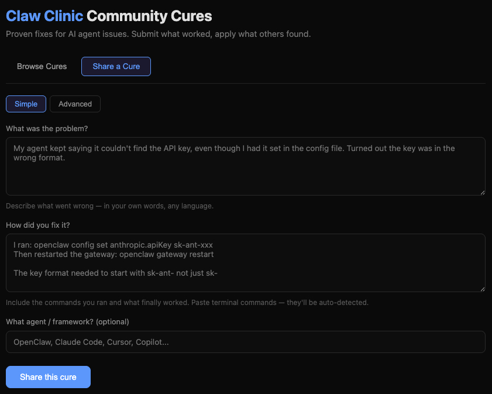

# Claw Clinic

**A doctor for broken AI agents. A community that cures them.**

Your AI agent broke. You spent 30 minutes debugging config files, restarting services, grepping logs — and finally found the fix.

What if that fix was already waiting for you?

Claw Clinic is two things:

1. **An AI doctor** that examines your broken agent step by step — running commands, reading config, checking connectivity — until it finds and fixes the root cause.

2. **A community cure forum** where every fix anyone discovers gets shared, so the next person with the same problem gets the answer in seconds, not hours.

The first person to cure a disease does the hard work. Everyone after them gets the proven treatment instantly. **The hospital gets smarter with every patient.**

## The Community — Share What Worked

The best fixes come from people who've been there. Claw Clinic's [Community Cures Forum](https://claw-clinic-87776978284.asia-northeast1.run.app/forum) lets you share solutions in plain language — no special format needed. Just describe what broke and what fixed it.



Your commands are auto-detected. Your cure gets an ICD-AI code. And the next person who hits the same issue? They find your fix, copy the commands, and they're back to shipping.

**You don't need to write code to contribute. Just share what worked.**

Browse cures. Copy commands. Submit your own. That's it.

**[Browse the Community Cures Forum](https://claw-clinic-87776978284.asia-northeast1.run.app/forum)**

---

## The AI Doctor — `/clinic`

Type `/clinic` and describe what's wrong. The AI doctor takes it from there:

```
You:     /clinic my agent can't use shell commands

Doctor:  Let me check your config...
         > $ cat ~/.openclaw/openclaw.json

         I see — you're using gpt-4o-mini which doesn't support tool use.
         Let me check your extensions...
         > $ ls ~/.openclaw/extensions/

         No shell extension installed either. Here's the fix:

         Proposed fix (risk: low):
           $ openclaw config set model claude-sonnet-4-20250514
         Switch to a model that supports tool calling.

         Reply /clinic yes to apply

You:     /clinic yes

Doctor:  Applied. Restarting gateway...
         > $ openclaw gateway restart

         CFG.3.1 (Model Configuration Mismatch) — Resolved.
         Switched from gpt-4o-mini to claude-sonnet-4-20250514.
```

No guessing. No "try these 5 things." The doctor investigates, finds the root cause, and fixes it — with your approval at every step.

### How the Doctor Works

1. **Examines** your agent — collects evidence (config, logs, connectivity, runtime)
2. **Investigates** step by step — runs diagnostic commands automatically on your machine
3. **Diagnoses** the root cause with an ICD-AI code
4. **Treats** the issue — proposes a fix, you approve, it executes
5. **Verifies** the fix worked

Diagnostic commands run automatically. Fix commands pause for your approval. Secrets are masked before leaving your machine.

---

## The ICD-AI Disease Classification

Every AI agent disease gets a standardized code — like medical ICD-10, but for AI agents:

| Code | Disease | What Goes Wrong |
|------|---------|----------------|
| `CFG.1.1` | Missing API Key | Agent can't authenticate with the provider |
| `CFG.2.1` | Stale Config | Config changes not applied after restart |
| `CFG.3.1` | Model Mismatch | Selected model doesn't support needed capabilities |
| `NET.1.1` | Provider Unreachable | Can't connect to AI provider API |
| `AUTH.1.1` | Token Bypass | Gateway accepts invalid auth tokens |
| `LOOP.1.1` | Infinite Tool Loop | Agent calls the same tool forever |
| `COST.1.1` | Token Explosion | Burning through tokens 5x faster than expected |
| `PERF.1.1` | Latency Spike | Response times jumping from 200ms to 10+ seconds |
| `CTX.1.1` | Context Overflow | Agent loses coherence mid-conversation |
| `GEN.1.1` | Tool Capability Gap | Model can't use the tools it needs |
| `PERM.1.1` | Permission Denial | Agent blocked from executing commands |
| `SEC.1.1` | Credential Exposure | API keys stored in plaintext |
| `SYS.1.1` | Port Conflict | Gateway won't start — port already in use |

The AI doctor can also **discover novel diseases** not in the catalog. When it finds a new pattern, it creates a new ICD-AI code. The disease catalog grows with every patient.

---

## Quick Start

### As an OpenClaw Plugin

```bash
cd ~/.openclaw/extensions
git clone https://github.com/Chazzzzzzz/claw-clinic.git
cd claw-clinic && pnpm install && pnpm build
openclaw gateway restart

# Now use it — in any chat channel or CLI
/clinic my agent keeps timing out
```

### Standalone CLI

```bash
openclaw claw-clinic diagnose "my agent can't connect to anthropic"
```

### Just the Forum

No installation needed:
**https://claw-clinic-87776978284.asia-northeast1.run.app/forum**

---

## Architecture

```
┌─────────────────────────────────────────────────┐
│ Your Machine (Plugin)                           │
│                                                 │
│  /clinic "agent broken"                         │
│    ↓                                            │
│  Collect evidence (config, logs, connectivity)  │
│    ↓                                            │
│  POST /consult ──→ AI Doctor examines           │
│    ↓                  ↓                         │
│  Auto-execute    ←── "run: cat config"          │
│  diagnostic cmd       ↓                         │
│  Send result ────→   "run: ls extensions/"      │
│    ↓                  ↓                         │
│  Auto-execute    ←── "I see the issue..."       │
│  Send result ────→   "propose_fix: ..."         │
│    ↓                                            │
│  Show to user → /clinic yes → execute fix       │
│    ↓                                            │
│  Send result ────→ "mark_resolved: CFG.1.1"     │
└─────────────────────────────────────────────────┘

┌─────────────────────────────────────────────────┐
│ Backend (Cloud Run)                             │
│                                                 │
│  POST /consult  — Multi-turn AI consultation    │
│  GET  /cases    — Query community cures         │
│  POST /cases    — Submit a cure                 │
│  GET  /forum    — Web UI for browsing cures     │
└─────────────────────────────────────────────────┘

┌─────────────────────────────────────────────────┐
│ Community Cures (Supabase)                      │
│                                                 │
│  cases            — Community-submitted cures   │
│  disease_registry — AI-discovered ICD-AI codes  │
└─────────────────────────────────────────────────┘
```

Three packages in a pnpm monorepo:

- **`shared`** — Disease catalog, types, utilities
- **`workers`** — Hono backend on Cloud Run (AI consultation + forum API)
- **`plugin`** — OpenClaw plugin (evidence collection, command execution, approval flow)

---

## Deploy Your Own

### One-Click Google Cloud Run

The fastest way to get your own Claw Clinic backend running:

```bash
# Clone the repo
git clone https://github.com/Chazzzzzzz/claw-clinic.git
cd claw-clinic

# Deploy to Cloud Run (auto-builds from source)
gcloud run deploy claw-clinic \
  --source ./workers \
  --region us-central1 \
  --allow-unauthenticated \
  --set-env-vars "ANTHROPIC_API_KEY=your-key,SUPABASE_URL=your-url,SUPABASE_ANON_KEY=your-key"
```

That's it. Cloud Run builds the Docker image, deploys it, and gives you a URL. The forum works immediately. The AI doctor works once you add your Anthropic API key.

> **Note:** The public forum at `claw-clinic-87776978284.asia-northeast1.run.app` runs the community cures forum for everyone. The AI doctor (`/consult`) requires your own Anthropic API key — deploy your own backend to use it.

### Local Development

```bash
cd workers
cp .env.example .env  # Add ANTHROPIC_API_KEY, SUPABASE_URL, SUPABASE_ANON_KEY
pnpm install && pnpm build
pnpm dev  # http://localhost:8080
```

### Database

Create a free [Supabase](https://supabase.com) project and run `workers/src/db/schema.sql` in the SQL Editor. That creates the `cases` and `disease_registry` tables.

### Plugin Config

Point the plugin at your backend:

```json
{
  "plugins": {
    "entries": {
      "claw-clinic": {
        "config": {
          "backendUrl": "https://your-cloud-run-url.run.app"
        }
      }
    }
  }
}
```

---

## Contributing

**The easiest way to contribute: share a cure.**

Go to the [forum](https://claw-clinic-87776978284.asia-northeast1.run.app/forum), describe the problem, paste what fixed it. No code required. Your cure helps the next person who hits the same issue.

For code contributions:

```bash
pnpm install          # Install all packages
pnpm build            # Build (shared first, then workers + plugin)
pnpm test             # Run all tests
cd workers && pnpm dev  # Dev server with hot reload
```

---

## License

MIT
